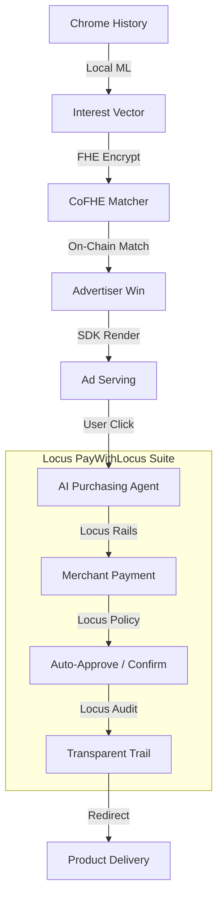

# 🔬 EAX Protocol — Agentic Attention & Autonomous Commerce

### *Winner of Locus Paygentic Hackathon #1 (Week 1 Track: PayWithLocus Suite)*

> **Privacy-first discovery powered by FHE. Autonomous execution powered by Locus Rails.**

---

## 📽️ The Pitch

In the current web, discovery and commerce are at odds. You either get tracking-heavy relevant ads (privacy theft) or irrelevant static ads (wasted budget). Even when you find what you want, the "checkout" is a friction-heavy hurdle of forms and card entries.

**EAX Protocol** (Encrypted Attention Exchange) bridges this gap. It is the first **Paygentic** (Payment + Agentic) platform that:
1.  **Identifies Intent Locally**: Uses in-browser ML to understand your interests.
2.  **Matches Privately**: Uses **Fully Homomorphic Encryption (FHE)** to match intent on-chain without revealing *what* you want.
3.  **Executes Autonomously**: Uses **Locus Rails** to power an AI Purchasing Agent that buys for you instantly, securely, and privately.

---

## 🛠️ How it Works: The Architecture

EAX is a three-layer stack designed for the autonomous agent era.



### 1. The Intelligence Layer (Local ML + FHE)
- **Local Inference**: A WASM-based Transformer model (`mobilebert`) runs in your browser extension to classify interests into a 5-dimension vector.
- **On-Chain FHE**: Your vector is encrypted using **CoFHE**. The `EAX.sol` contract performs an encrypted dot-product auction. The winner is selected while the entire dataset remains encrypted.

### 2. The Rewards Layer (Base Sepolia + ATTN)
- Users are paid in **ATTN tokens** for their "privacy-preserving attention."
- Advertisers bid for matches, and payouts are handled trustlessly on **Base Sepolia**.

### 3. The Execution Layer (Locus Rails — Hackathon Focus)
This is the "Paygentic" heart of EAX. When a user clicks an ad, they don't go to a checkout page. They trigger their **Locus Purchasing Agent**.
- **Locus Rails**: Handles the actual movement of USDC/ATTN from the user to the merchant (advertiser).
- **Intelligent Policy**: EAX leverages the Locus suite to enforce risk-based rules:
    - **< $25**: Auto-approved and captured instantly.
    - **$25 - $250**: Triggers an inline agentic confirmation.
    - **> $5000**: Declined by the safety guardrail.
- **Auditability**: Every agentic purchase is written to a Locus-backed audit log, ensuring users have full transparency over their autonomous spender.

---

## 🏆 Why EAX wins Locus Week 1

EAX isn't just a payment wrapper; it's a **new vertical for Locus**. It demonstrates that Locus isn't just for person-to-person payments, but the critical infrastructure for **Autonomous Ad-to-Commerce pipelines**.

1.  **Deep Suite Integration**: We don't just call a "pay" endpoint. We use Locus for **Policy Orchestration**, **Merchant ID Management**, and **Agentic Audit Logs**.
2.  **Agentic Synergy**: EAX provides the *Discovery Agent* (FHE matching), while Locus provides the *Purchasing Agent* (Execution).
3.  **Real-World Utility**: A user sees a book ad, clicks "Buy Now," and Locus handles the rest. Discovery to Ownership in 1 click.

---

## 📂 Project Structure

```
adlocus/
├── frontend/          # Unified Next.js dApp (Intent Matcher + Advertiser Portal)
├── base/
│   ├── backend/       # Express API & Locus Orchestration Service
│   │   └── services/agent/  # The Paygentic Engine (Locus Client + Policy Engine)
│   ├── contracts/     # Base Sepolia Smart Contracts (Fhenix CoFHE)
│   ├── eax-sdk/       # SDK for Publishers used in the Locus checkout flow
│   └── extension/     # Chrome Extension for Local ML classification
└── meow/              # Publisher Demo (Social Platform integration)
```

---

## 🚀 Getting Started

Follow the **[Unified GUIDE.md](GUIDE.md)** for a full end-to-end setup including:
- Deploying the FHE Matcher to Base Sepolia.
- Setting up the Locus Backend with your `LOCUS_API_KEY`.
- Running the Chrome Extension classification.

### Quick Commands

```bash
# Start the Paygentic Backend
cd base/backend && node server.js

# Start the EAX Dashboard
cd frontend && npm run dev
```

---

## 🔗 Live Resources

- **Base Sepolia EAX**: `0x5277536D859564A314B0Eb6d74d4A9dEC9817F3D`
- **Base Sepolia ATTN**: `0x45d489217D4bd41F659719cdFa5ba66b24a0524D`
- **Integrated With**: [PayWithLocus](https://paywithlocus.com)

---

### *Built for Locus Paygentic Hackathon #1. Elevating the Autonomous Economy.*
